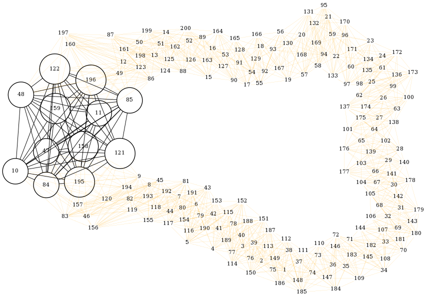

#+AUTHOR: 0x0584
#+EMAIL: archid-@student.1337.ma

* About
  

  - compile using =make RELEASE=1 DEBUG=0 THREADS=8 clean mc=
  - to visualise the graph and the clique use =sfdp out.dot -odata.png -Tpng=
  - run program and use =-h= to see the arguments

* Max Click Problem

* Algorithm
** multi-threaded version
** distributed version

* Implementation

* TODOs
SCHEDULED: <2025-10-01 Wed>

+ [ ] introduce caching neighbourhood
+ [ ] make colouring concurrent
+ [ ] make enumeration concurrent
+ [ ] benchmark before and after
  
